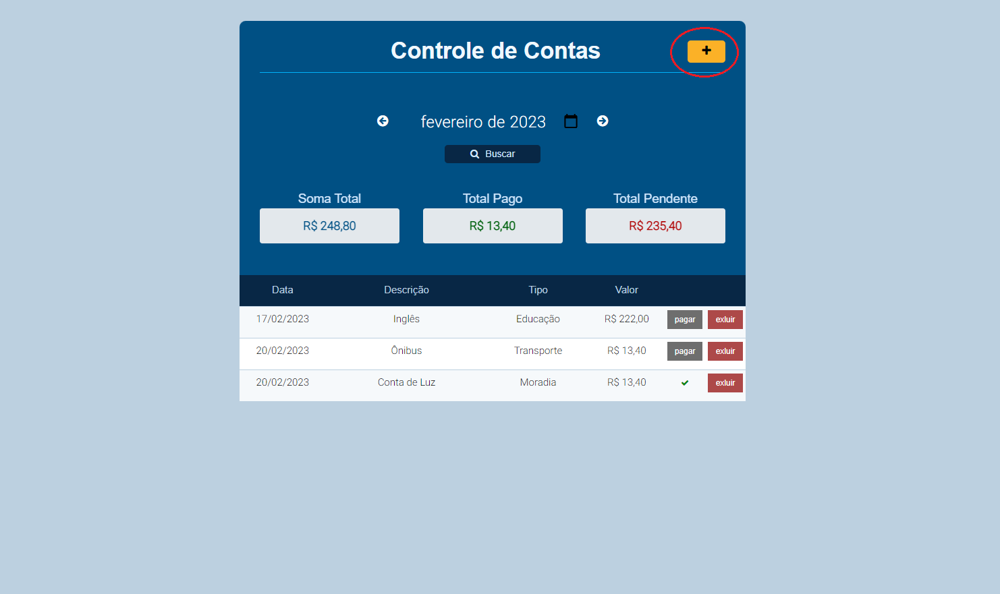
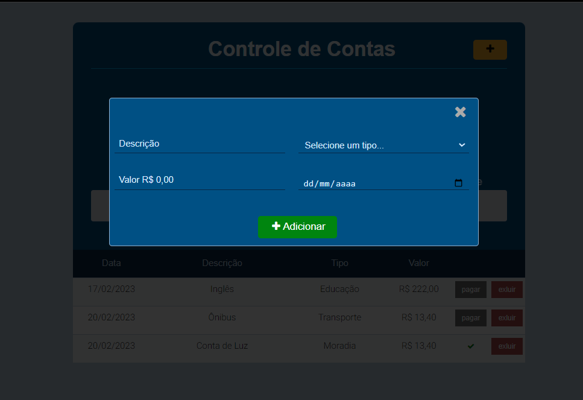
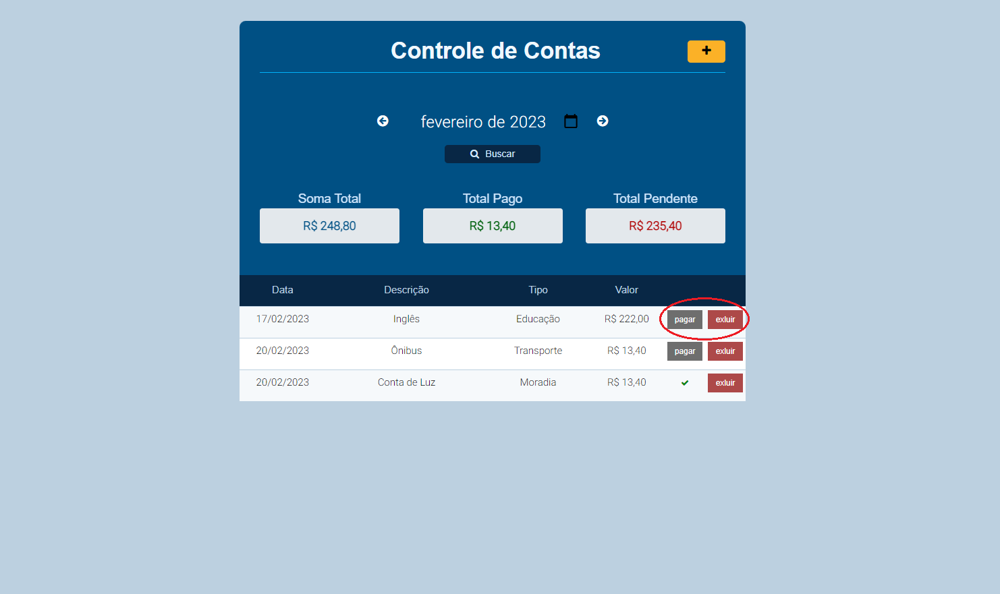
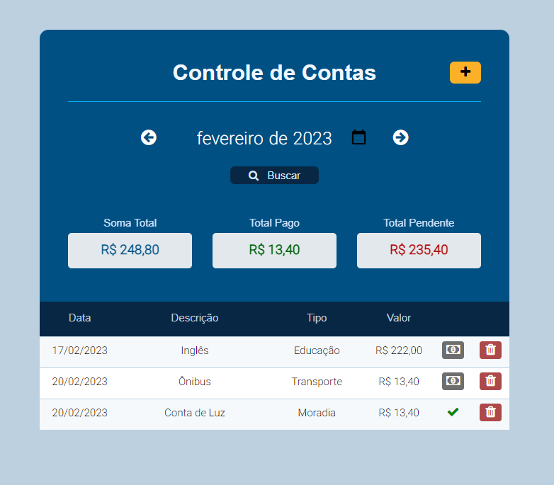
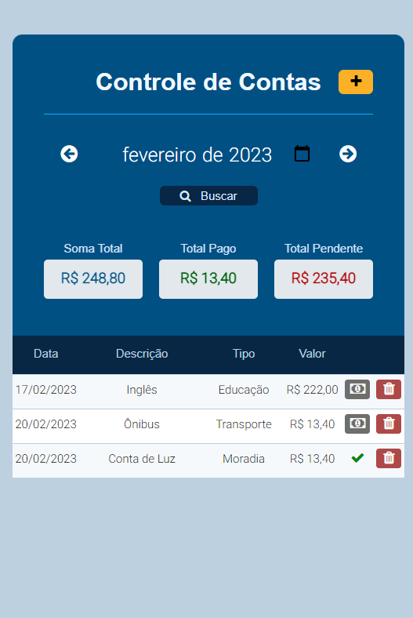
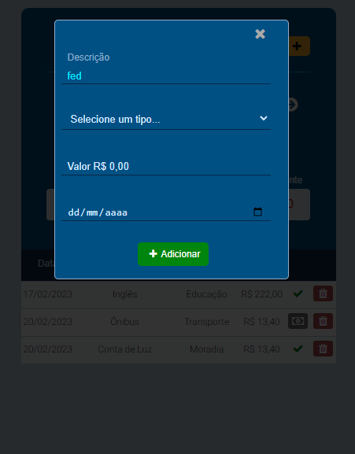

<h2 align="center">Projeto Controle de Contas Pessoais</h2>
<h1 align="center">JavaScript e TypeScript</h1>

</img>

 

 

  
Dependencias

  
  
  
  
  

 
 

<h2 align="center">:memo:Instruções para executar os projetos</h2>
 

Para ambos os projetos, em suas respectivas - sendo a pasta do Javascript e Typescript, rodar o seguinte comando:

<b><i>"npm install"</i></b> - para instalar todas as dependências do projeto.

 

  
  <h3 align="center"># Projeto JavaScript #</h3></td>
 

Para subir o projeto rodar o comando:

<b><i>“npm run start”</b></i> – isso irá rodar os comandos <b><i>“npm run database”</b></i> e <b><i>“npm run server”</b></i>. 

 

:eyes: Observação:

Caso ocorra algum erro no comando “npm run open”, fazer os seguintes passos:

<ul>
  <li>1 - Pare a execução do projeto dando <b><i>“Ctrl+c”</i></b> no terminal.</li>
  <li>2 - Instale o Live-server com o comando <b><i>“npm install -g live-server”</i></b> ou <b><i>"sudo npm install -g live-server"</i></b> para Linux.</li>
  <li>3 - Rode novamente o projeto com “npm run start”.</li>
</ul>

Caso ocorra erro com o <i>“concurrently”</i>, rodar os comandos <b><i>“npm server”</i></b> e <b><i>“npm open”</i></b> em terminais diferentes.

 
 

  
  <h3 align="center"># Projeto TypeScript #</h3></td>

Para subir o projeto rodar o comando:

<b><i>“npm run start”</i></b> – isso irá rodar os comandos <b><i>“npm run watch”</i></b>, <b><i>“npm run database”</i></b> e <b><i>“npm run server”</i></b>.
 
 

:eyes: Observação:

Caso ocorra erro com o <i>“concurrently”</i>, rodar os comandos <b><i>“npm run watch”</i></b>, <b><i>“npm run database”</i></b> e <b><i>“npm run server”</i></b> em terminais diferentes.

 

<h2 align="center">:hammer: Funcionalidades</h2>
 

- Funcionalidade 1: Criação de uma nova conta clicando em <b><i>“nova conta”</i></b>.

<table align="center">
  <tr>
    <td></img></td>
    <td></img></td>
  <tr>
<table>
 

- Funcionalidade 2: Navegação entre os meses utilizando as <b><i>“setas”</i></b> e pesquisa de um mês específico atavés do botão <b><i>“pesquisar”</i></b>.

</img>

 

- Funcionalidade 3: pagamento e exclusão de conta desejada através dos botões <b><i>“pagar”</i></b> e <b><i>“excluir”</i></b>.

</img>

 
 

  
<b>.: Desing Responsivo :.</b>

  
O projeto também conta com a aplicação de desing responsivo para tablet e mobile

   
  <table align="center">
    <tr>
      <td></img></td>
      <td></img></td>
      <td></img></td>
    <tr>
  <table>

  
AUTOR

  
Carlos Cirqueira

   

